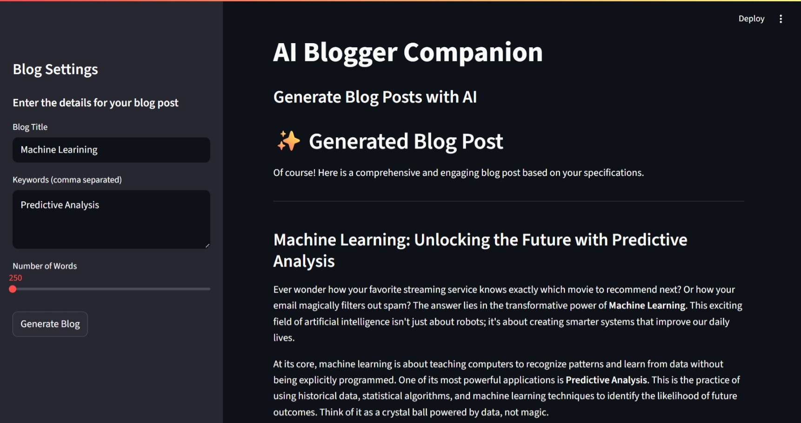

# AI Blogger Companion  

**AI Blogger Companion** is a Streamlit-based web application that generates high-quality blog posts using **Google Gemini’s `gemini-2.5-pro` model**. With a clean and intuitive interface, you can instantly create engaging, original, and keyword-rich articles tailored to your needs.  

## 🚀 Features  
-  **AI-Powered Blog Generation** – Create comprehensive, original blog posts in seconds.  
-  **Keyword Integration** – Automatically weaves your chosen keywords into the article.  
-  **Fast & Interactive UI** – Built with Streamlit for a smooth user experience.  
-  **Customizable Output** – Choose your desired word count for the blog post.  
-  *(Optional)* **AI Image Generation** – Extend functionality with Gemini Imagen 3 or OpenAI DALL·E.  

## 🛠 Tech Stack  
- **Python 3**  
- **Streamlit** (UI framework)  
- **Google Generative AI (Gemini)** for blog text generation  

## 📖 How It Works  
1. Enter your blog title, keywords (comma-separated), and desired word count.  
2. The app sends your input to **Google Gemini** for text generation.  
3. The AI returns a polished, keyword-rich blog post.  
4. *(Optional)* Generate related images to complement your post.  

## Use Cases  
- Content creators looking for fast inspiration  
- Bloggers generating ready-to-publish drafts  
- SEO specialists crafting keyword-focused articles  
- Students preparing write-ups or summaries  

## 📸 Preview

